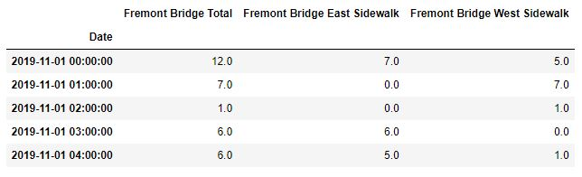
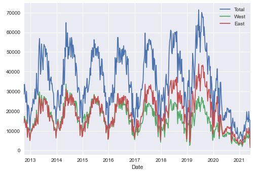
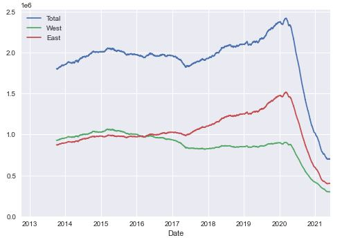
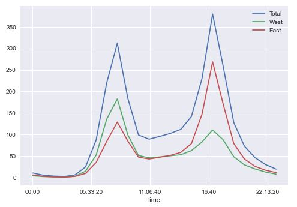
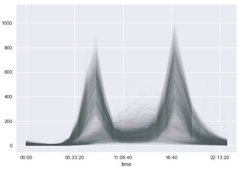
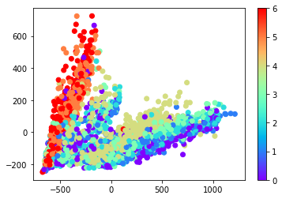

# Reproducible Data Analysis in Jupyter

When starting to learn Python it is crucial at some point to take a step away from only nonlinear, trial-and-error style of exploration to a more linear and reproducible analysis. And to have organized, packaged, and tested code. This code in this repository comes from a **training to apply reproducible data analysis** within the Jupyter notebook. For more information on the training go to [the blog of Jake Vanderplas](http://jakevdp.github.io/blog/2017/03/03/reproducible-data-analysis-in-jupyter/)

The Data used in this training is from Seattle the [Fremont Bridge Bicycle Counter](https://data.seattle.gov/Transportation/Fremont-Bridge-Bicycle-Counter/65db-xm6k) - The Fremont Bridge Bicycle Counter began operation in October 2012 and records the number of bikes that cross the bridge using the pedestrian/bicycle pathways.

## Visuals

- Structure of the Data:  
  
- Analysis:  
  
  
  

  

## Installation

If you are using Anaconda, you will not need to install any libaries. You will only need to import following libaries:
- [urllib.request](https://docs.python.org/3/library/urllib.request.html) - an extensible library for opening URLs. 
```bash
from urllib.request import urlretrieve
```
- [pandas](https://docs.python.org/3/library/urllib.request.html) - a fast, powerful, flexible and easy to use open source data analysis and manipulation tool, built on top of the Python programming language.
```bash
import pandas as pd
```
- [matplotlib.pyplot](https://matplotlib.org/2.0.2/api/pyplot_api.html)- Provides a MATLAB-like plotting framework.

```bash
import matplotlib.pyplot as plt
```
- [PCA](https://scikit-learn.org/stable/modules/generated/sklearn.decomposition.PCA.html)- for the Principal component analysis.

```bash
from sklearn.decomposition import PCA
```
- [GaussianMixture](https://scikit-learn.org/stable/modules/generated/sklearn.mixture.GaussianMixture.html)- for the Unsupervised Clustering.

```bash
from sklearn.decomposition import PCA
```

- Be sure to also copy the folder **jupyterworkflow** which includes the used function get_fremont_data.
```bash
from jupyterworkflow.data import get_fremont_data
```

## Contributing
This is the code from the training of Jake Vanderplas. For more information or to also conduct the training visit [his blog post](http://jakevdp.github.io/blog/2017/03/03/reproducible-data-analysis-in-jupyter/)

## License
[MIT](https://choosealicense.com/licenses/mit/)
